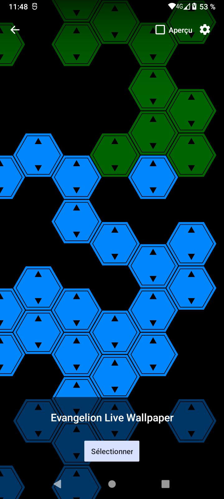

# Evangelion Live Wallpaper

**EN** — An Evangelion-inspired Android live wallpaper with hexagonal tiles that react to battery level and charging.

**FR** — Un fond d’écran animé Android inspiré d’Evangelion, avec des tuiles hexagonales qui réagissent au niveau de batterie et à la charge.

## Screenshots / Captures d’écran

**EN** — Examples of the four battery states and the charging effect. Colors, labels and thresholds are customizable; the battery percentage in the Android status bar does not necessarily match the demonstrated state. The ranges below are the defaults.

**FR** — Exemples des quatre états de batterie et de l’effet de charge. Les couleurs, textes et seuils sont personnalisables ; le pourcentage de la barre d’état Android ne correspond pas nécessairement à l’état illustré. Les plages ci-dessous sont celles par défaut.

### 1. Perfect / Parfait


**EN** — Green tiles indicate the highest battery range: **50–100%** by default.

**FR** — Les tuiles vertes indiquent la plage de batterie la plus élevée : **de 50 à 100 %** par défaut.

### 2. OK


**EN** — Yellow tiles indicate an intermediate battery level: **30% to below 50%** by default.

**FR** — Les tuiles jaunes indiquent un niveau de batterie intermédiaire : **de 30 à moins de 50 %** par défaut.

### 3. Low / Mauvais


**EN** — Orange tiles display **WARNING** for a low battery level: **15% to below 30%** by default.

**FR** — Les tuiles orange affichent **WARNING** lorsque la batterie est faible : **de 15 à moins de 30 %** par défaut.

### 4. Very low / Critique


**EN** — Red tiles display **EMERGENCY** for a critical battery level: **below 15%** by default.

**FR** — Les tuiles rouges affichent **EMERGENCY** lorsque la batterie est critique : **moins de 15 %** par défaut.

### 5. Charging / En charge



**EN** — While charging, lit tiles pulse together and change to the charging color from bottom to top. This capture shows the blue sweep in progress. Once filled, the color is held briefly before the cycle restarts.

**FR** — Pendant la charge, les tuiles allumées pulsent ensemble et prennent la couleur de charge du bas vers le haut. Cette capture montre le balayage bleu en cours. Une fois le remplissage terminé, la couleur est maintenue avant le début du cycle suivant.

## Features / Fonctionnalités

**EN**

- Hexagonal mosaic on a black background, with 3 pixels between colored tile faces.
- Four battery states with customizable thresholds, colors and text.
- Tile count proportional to battery level, with a configurable minimum of 7 by default.
- Random tile relocation with independent appearance and disappearance effects: fluorescent flicker or fade.
- Charging animation with configurable color, pulse duration, minimum opacity, fill time and hold time.
- Animation pauses when the wallpaper is hidden. Settings are stored locally.

**FR**

- Mosaïque hexagonale sur fond noir, avec 3 pixels entre les faces colorées des tuiles.
- Quatre états de batterie avec seuils, couleurs et textes personnalisables.
- Nombre de tuiles proportionnel à la batterie, avec un minimum réglable de 7 par défaut.
- Déplacement aléatoire des tuiles avec effets d’apparition et de disparition indépendants : clignotement fluorescent ou fondu.
- Animation de charge avec couleur, durée du pulse, opacité minimale, temps de remplissage et de maintien réglables.
- Animation suspendue lorsque le fond est masqué. Réglages enregistrés localement.

## Settings / Configuration

**EN** — Open the application to configure the wallpaper. The interface is currently in French and organized into four sections. Tap **Appliquer** to save, or **Prévisualiser / choisir ce fond** to save and open Android’s wallpaper picker. Restoring defaults requires tapping **Appliquer** to save them.

**FR** — Ouvre l’application pour configurer le fond d’écran. L’interface est organisée en quatre sections. Touche **Appliquer** pour enregistrer, ou **Prévisualiser / choisir ce fond** pour enregistrer et ouvrir le sélecteur de fond d’écran Android. Après une restauration des valeurs par défaut, touche **Appliquer** pour les enregistrer.

| Section | Settings / Réglages | Defaults / Valeurs par défaut |
| --- | --- | --- |
| Battery / Batterie | State thresholds and minimum tile count / Seuils des états et minimum de tuiles | 15%, 30%, 50%; 7 tiles / tuiles |
| Colors / Couleurs | Color and optional text for each state / Couleur et texte optionnel pour chaque état | Green, yellow, orange, red / Vert, jaune, orange, rouge |
| Charging effect / Effet de charge | Color, full pulse duration and minimum opacity / Couleur, durée complète du pulse et opacité minimale | Blue / Bleu `#0088FF`; 1 s; 40% |
| Charging effect / Effet de charge | Fill and hold durations / Durées de remplissage et de maintien | 4 s; 5 s |
| Tile animation / Animation des tuiles | Appearance and disappearance effects / Effets d’apparition et de disparition | Flicker / Clignotement |

**EN** — Pulse duration is one complete fade-out/fade-in cycle, adjustable from 0.2 to 5 seconds. Minimum opacity ranges from 0 to 100%: 40% means a pulse between 100% and 40% opacity. Fill time ranges from 1 to 30 seconds; hold time from 0 to 60 seconds.

**FR** — La durée du pulse correspond à un cycle complet de fondu sortant puis entrant, réglable de 0,2 à 5 secondes. L’opacité minimale va de 0 à 100 % : 40 % signifie une pulsation entre 100 % et 40 % d’opacité. Le remplissage est réglable de 1 à 30 secondes, et le maintien de 0 à 60 secondes.

## Build / Compilation

**EN** — Requires Android 8.0 (API 26) or newer on the device. The provided setup scripts target Linux x86_64 and require `curl`, `unzip` and `tar`. Run these commands from the project directory. Initial setup requires Internet access, several GB of free space and acceptance of the Android SDK licenses.

**FR** — L’appareil doit utiliser Android 8.0 (API 26) ou une version ultérieure. Les scripts d’installation ciblent Linux x86_64 et nécessitent `curl`, `unzip` et `tar`. Exécute ces commandes depuis le répertoire du projet. La première installation demande un accès Internet, plusieurs Go disponibles et l’acceptation des licences du SDK Android.

```bash
./scripts/setup.sh
source scripts/env.sh
./scripts/build.sh
```

**EN** — The application is written in Kotlin. The build uses JDK 21, Gradle 8.11.1, Android Gradle Plugin 8.9.2, Kotlin 2.2.21 and Android SDK 35. Tools are installed locally in `.tools/`.

**FR** — L’application est écrite en Kotlin. La compilation utilise le JDK 21, Gradle 8.11.1, Android Gradle Plugin 8.9.2, Kotlin 2.2.21 et le SDK Android 35. Les outils sont installés localement dans `.tools/`.

**EN** — To rebuild after editing, once dependencies are cached:

**FR** — Pour recompiler après des modifications, une fois les dépendances téléchargées :

```bash
source scripts/env.sh
./gradlew --offline --no-daemon :app:assembleDebug
```

**EN** — Remove `--offline` when adding dependencies that need downloading. Output APK:

**FR** — Retire `--offline` si de nouvelles dépendances doivent être téléchargées. APK généré :

```text
app/build/outputs/apk/debug/app-debug.apk
```

## Install / Installation

**EN** — Download the signed APK from [GitHub Releases](https://github.com/ryosama/evangelion-android-live-wallpaper/releases). Open it on your Android device and allow installation from that source when prompted, or install it over USB with `adb install -r <downloaded-file.apk>`.

**FR** — Télécharge l’APK signé depuis les [releases GitHub](https://github.com/ryosama/evangelion-android-live-wallpaper/releases). Ouvre-le sur ton appareil Android et autorise l’installation depuis cette source lorsque demandé, ou installe-le en USB avec `adb install -r <fichier-téléchargé.apk>`.

**EN** — Enable Developer options and USB debugging on the device, connect it over USB, then accept the debugging authorization. Install and open the application:

**FR** — Active les options développeur et le débogage USB sur l’appareil, connecte-le en USB, puis accepte l’autorisation de débogage. Installe et ouvre l’application :

```bash
source scripts/env.sh
adb devices -l
adb -d install -r app/build/outputs/apk/debug/app-debug.apk
adb -d shell am start -n org.evawallpaper/.MainActivity
```

**EN** — Tap **Prévisualiser / choisir ce fond**, then confirm in Android’s wallpaper picker. No Google Play account is required. This command installs a debug APK; updates preserve settings when both application ID and signing key match.

**FR** — Touche **Prévisualiser / choisir ce fond**, puis confirme dans le sélecteur Android. Aucun compte Google Play n’est nécessaire. Cette commande installe une APK de développement ; les mises à jour conservent les réglages si l’identifiant d’application et la clé de signature restent identiques.

## Development / Développement

**EN** — See the [code architecture and maintenance guide (French)](docs/architecture.md) for the data flow between files, units and lifecycle rules. Functions and important state variables are documented in the source.

**FR** — Consulte le [guide d’architecture et de maintenance](docs/architecture.md) pour suivre les échanges entre fichiers, les unités et le cycle de vie. Les fonctions et variables d’état importantes sont commentées dans les sources.

**EN** — Main source files:

**FR** — Principaux fichiers sources :

| File / Fichier | Purpose / Rôle |
| --- | --- |
| [`MainActivity.kt`](app/src/main/kotlin/org/evawallpaper/MainActivity.kt) | Configuration interface / Interface de configuration |
| [`EvaWallpaperService.kt`](app/src/main/kotlin/org/evawallpaper/EvaWallpaperService.kt) | Wallpaper rendering and lifecycle / Rendu et cycle de vie du fond |
| [`WallpaperConfig.kt`](app/src/main/kotlin/org/evawallpaper/WallpaperConfig.kt) | Settings and defaults / Réglages et valeurs par défaut |
| [`ChargingPulse.kt`](app/src/main/kotlin/org/evawallpaper/ChargingPulse.kt) | Charging animation timing / Calcul des animations de charge |

**EN** — Run unit tests and Android lint:

**FR** — Exécuter les tests unitaires et l’analyse Android :

```bash
source scripts/env.sh
./gradlew --offline --no-daemon :app:testDebugUnitTest :app:lintDebug
```

**EN** — An optional Android 12 emulator can be started with `./scripts/emulator.sh` on a Linux machine with hardware virtualization and KVM. Use `adb -e` instead of `adb -d` to target it.

**FR** — Un émulateur Android 12 peut être lancé avec `./scripts/emulator.sh` sur une machine Linux disposant de la virtualisation matérielle et de KVM. Utilise `adb -e` à la place de `adb -d` pour le cibler.
