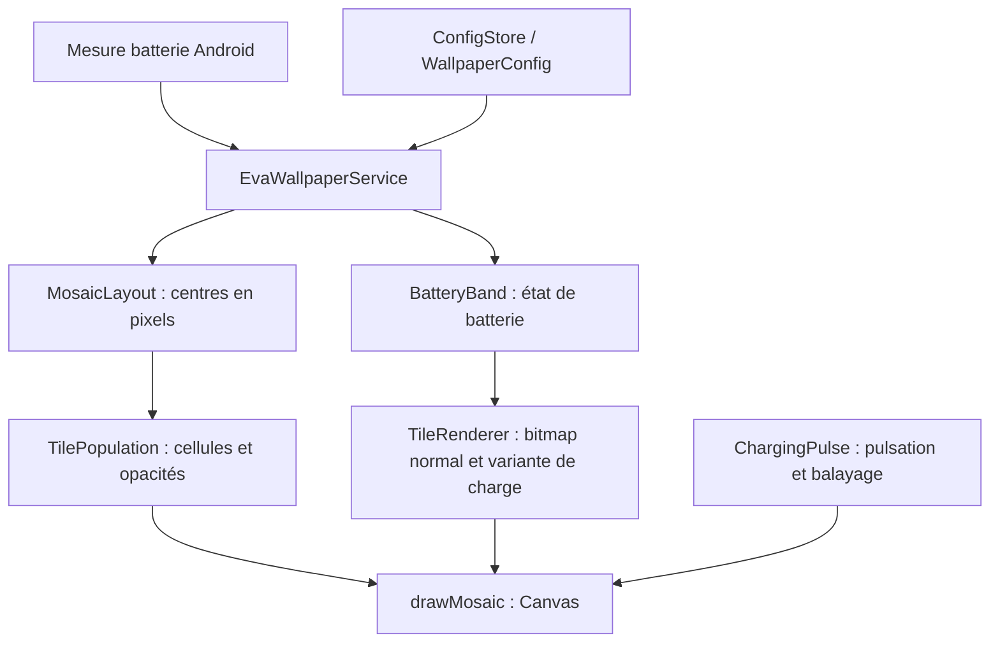

# Guide de lecture du code

Les commentaires du code et ce guide décrivent les responsabilités des fichiers.
L’interface et le service du fond sont indépendants : ils communiquent par les réglages persistés,
pas par une référence directe à la scène affichée.

## Parcours d’un changement de réglage

1. `MainActivity` lit `ConfigStore` et crée `draft`, une copie immuable des réglages.
2. Les curseurs et sélecteurs remplacent des propriétés de `draft` avec `copy`.
   `TileRenderer` produit les aperçus sans modifier le fond installé.
3. **Appliquer** et **Prévisualiser** appellent `ConfigStore.write`. Restaurer les valeurs
   par défaut modifie seulement le brouillon tant que l’utilisateur ne valide pas.
4. `ConfigStore` enregistre un JSON unique dans SharedPreferences. Le listener de
   `EvaWallpaperService` relit les réglages, invalide le cache visuel et réutilise la dernière mesure.
5. `updateBattery` recalcule l’état, la population et les bitmaps avant `drawMosaic`.

## Parcours d’une image du fond

Le service convertit la largeur nominale en dp vers des pixels pour `MosaicLayout`.
Chaque `Light.cell` de `TilePopulation` est un **indice** de la liste des centres,
et non une coordonnée. Il faut donc recréer la population lorsque la grille change.
Les tuiles coupées par les bords restent dans cette liste si leur rectangle intersecte l’écran.

Hors charge, `advance` fait évoluer les relais et `lights` calcule leurs opacités.
`nextDelay` permet au service d’attendre entre les animations plutôt que de dessiner en continu.
Pendant la charge, `settleTarget` stabilise les positions ; `ChargingPulse` module l’opacité
et sélectionne les cellules déjà balayées du bas vers le haut.

## Contrats à préserver

- **Ordre des états** : `BatteryBand`, `WallpaperConfig.styles` et les aperçus suivent
  Parfait, OK, Mauvais, Critique. Le curseur les affiche dans l’ordre inverse (0 à 100 %).
- **Temps** : le moteur et la population utilisent des millisecondes monotones
  (`SystemClock.uptimeMillis`). Les durées de remplissage et maintien sont stockées
  en secondes, puis converties par `ChargingPulse` ; le pulse est stocké en millisecondes.
- **Opacité** : les profils renvoient 0..1, le réglage minimal utilise 0..100,
  et `Paint.alpha` reçoit 0..255. Une disparition utilise le complément du profil choisi.
- **Mémoire** : chaque appel de `TileRenderer.render` donne au demandeur la responsabilité
  de recycler le bitmap. Activité et moteur ont chacun leurs propres images.
- **Cycle de vie** : visibilité et disponibilité de surface sont deux conditions distinctes.
  Le service retire les callbacks quand le fond est masqué ou la surface détruite.
- **Persistance** : ajouter un réglage implique le modèle, ses limites, la sérialisation,
  une valeur de repli dans `decode`, le contrôle de configuration et le consommateur du réglage.
  Le brouillon sauvegardé lors d’une rotation passe aussi par `encode`/`decode`.

## Où intervenir

| Modification | Fichiers à consulter |
| --- | --- |
| Contrôles, textes et organisation de l’écran | `MainActivity.kt`, `res/values/strings.xml` |
| Réglages et compatibilité des données sauvegardées | `WallpaperConfig.kt`, `ConfigStore.kt` |
| Seuils et couleurs des états | `BatteryBand.kt`, `BatteryRangeSlider.kt`, `WallpaperConfig.kt` |
| Taille, espacement et couverture des bords | `MosaicLayout.kt` |
| Forme, recoloration et texte d’une tuile | `TileRenderer.kt`, SVG de `inspiration/`, `scripts/export-tiles.sh` |
| Nombre de tuiles et relais | `TilePopulation.kt`, `TileEffect` dans `WallpaperConfig.kt` |
| Pulsation et ordre du remplissage | `ChargingPulse.kt`, branche charge de `drawMosaic` |
| Notifications Android et planification du rendu | `EvaWallpaperService.kt` |

Les tests Kotlin de `app/src/test` couvrent la géométrie, les seuils, la population
et les profils temporels sans lancer Android. Les callbacks du service et l’interface
nécessitent aussi une vérification sur appareil pour un changement fonctionnel.
Les scripts de `scripts/` partagent l’environnement de `env.sh` ; le Gradle Wrapper
(`gradlew`, `gradlew.bat`, `gradle/wrapper/`) est généré et n’est pas du code applicatif.
